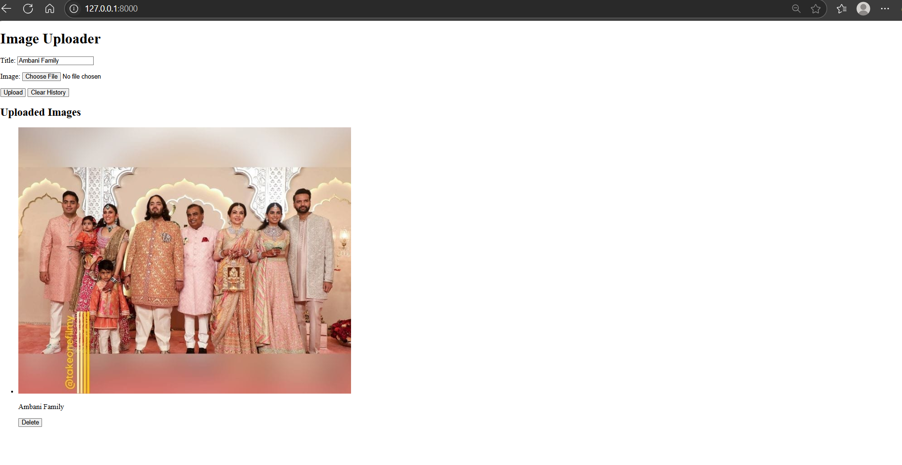

# Django Image Uploader 🖼️

A simple but effective web application built with Python and the Django framework. This project provides a clean interface for users to upload images with a title, view a gallery of all uploaded images, and clear the entire history with a single click.

## ✨ Key Features

* **Effortless Image Uploads:** A straightforward form to select an image from your device and give it a title.
* **Dynamic Image Gallery:** All uploaded images are displayed in a clean, scrollable gallery on the main page.
* **Bulk Deletion:** A "Clear History" option to instantly remove all images from the database.
* **Lightweight & Fast:** Built with Django's powerful backend and standard HTML/CSS for a responsive user experience.

## 📸 Application Preview

Here is a look at the application's user interface:



## 🛠️ Technologies Used

* **Backend:** Python, Django
* **Database:** SQLite (Django's default)
* **Frontend:** HTML
* **Core Dependencies:** `Pillow` for image processing in Python.

## 🚀 Getting Started

Follow these instructions to get a copy of the project up and running on your local machine for development and testing purposes.

### Prerequisites

* Python 3.x
* pip (Python package installer)

### Installation

1.  **Clone the GitHub repository:**
    ```bash
    git clone [https://github.com/harshal2424/Image-Uploader-Django-Project.git](https://github.com/harshal2424/Image-Uploader-Django-Project.git)
    cd Image-Uploader-Django-Project
    ```

2.  **Create and activate a virtual environment:**
    * It's best practice to use a virtual environment. You mentioned using `myenv`, so let's stick with that.

    ```bash
    # Create the virtual environment
    python -m venv myenv

    # Activate it (on Windows)
    .\myenv\Scripts\activate

    # Activate it (on macOS/Linux)
    source myenv/bin/activate
    ```

3.  **Install the required packages:**
    ```bash
    pip install Django Pillow
    ```

4.  **Set up the database:**
    * This will create the necessary tables in your SQLite database based on the `models.py` file.
    ```bash
    python manage.py migrate
    ```

5.  **Run the development server:**
    ```bash
    python manage.py runserver
    ```

6.  **View the application!**
    * Open your favorite web browser and navigate to `http://127.0.0.1:8000/`.
      
## 📖 How to Use the App

* **To Upload an Image:**
    1.  Fill in the **Title** field.
    2.  Click **"Choose File"** to select an image from your computer.
    3.  Click the **"Upload"** button. The page will refresh, and your new image will appear in the "Uploaded Images" gallery.

* **To Clear All Images:**
    1.  Simply click the **"Clear History"** button. All images will be deleted from the application.
